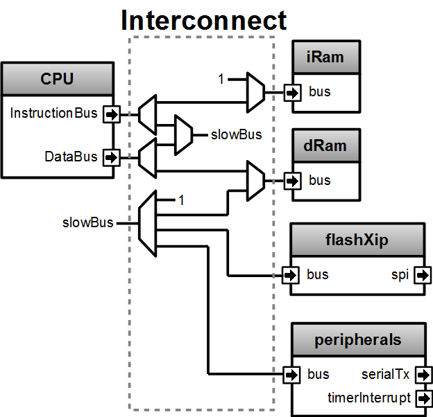
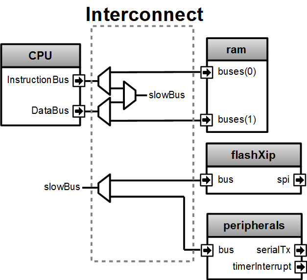
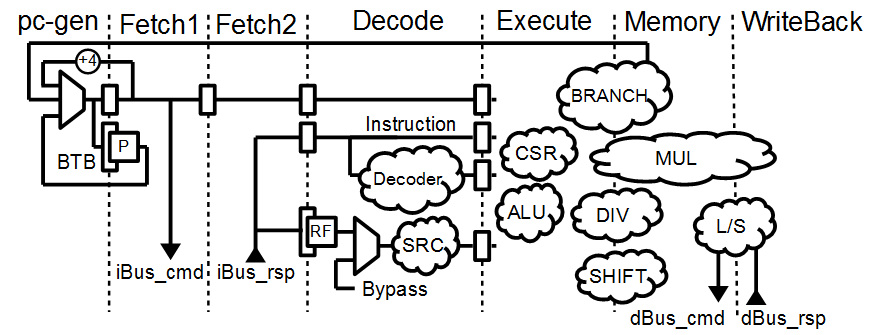
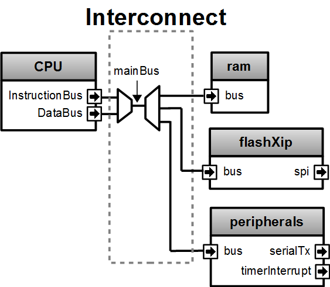
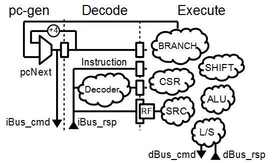
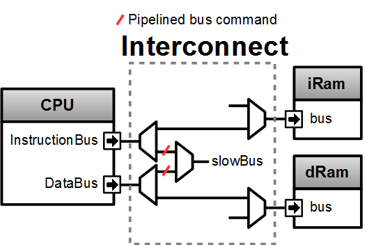

================================================
Overview
================================================

This repository is a RISC-V SoftCPU Contest entry. It implement 3 SoC :

- Igloo2Perf : Performant Microsemi IGLOO®2 implementation
- Up5kPerf : Performance Lattice iCE40 UltraPlus™ implementation
- Up5kArea : Small Lattice iCE40 UltraPlus™ implementation

For each of those SoC a port was made for a physical board :

- Igloo2PerfCreative : https://www.microsemi.com/existing-parts/parts/143948
- Up5kPerfEvn : https://www.latticesemi.com/Products/DevelopmentBoardsAndKits/iCE40UltraPlusBreakoutBoard
- Up5kAreaEvn : https://www.latticesemi.com/Products/DevelopmentBoardsAndKits/iCE40UltraPlusBreakoutBoard

There are some general informations :

- Hardware description made in SpinalHDL/Scala
- CPU used in SoCs is VexRiscv
- Netlist exported in Verilog
- Simulations made with Verilator
- Pass all RV32I compliance tests
- Zephyr OS ready

There is some informations about VexRiscv (CPU used) :

- Hosted on https://github.com/SpinalHDL/VexRiscv
- Implement RV32I[M][C]
- Optimized for FPGA
- Pipelined CPU with a parametrable number of stages : (Fetch -> 0 \.\. x stages) Decode Execute [Memory] [Writeback]
- Deeply parametrable via a system of plugins and a dataflow hardware description layer implemented on the top of SpinalHDL/Scala

================================================
Requirements
================================================

This repository was developed on Linux VM. Only the Libero synthesis and the serial ports interaction where done on Windows.

This repository has some git submodules (Zephyr, compliance, VexRiscv), you need to clone it recursively:

.. code-block:: sh

  git clone https://github.com/SpinalHDL/riscvSoftcoreContest.git --recursive

Requirements :

- Icestorm
- Libero 11.8 SP2 (11.8.2.4)
- Icecube 2 2017.08.27940
- Zephyr SDK
- Java JDK 8, to regenerate the netlist
- SBT, to regenerate the netlist
- Python 2.7, to generate the igloo2 SPI flash programmation files

================================================
Repository structure
================================================

- makefile : Contain most of the commands you will need
- hardware

  - scala : Contain the SpinalHDL/Scala hardware description of the SoCs
  - netlist : Contain the verilog files generated by SpinalHDL
  - synthesis : Contain the synthesis projects (Icestorm, Icecube2, Libero)
- software

  - bootloader
  - dhrystone
- test : Verilator testbenches
- ext : External dependancies (Zephyr, compliance)
- doc
- scripts
- project : Scala SBT project folder

================================================
Up5kPerf / Igloo2Perf
================================================

Those two SoC (Up5kPerf and Igloo2Perf) try to get the maximal dhrystone score. Both are very similar, as they only differ in their memory architecture.

There is some characteristics of the VexRiscv configuration used :

- RV32IM
- 6 stages : 2xFetch, Decode, Execute, Memory, Writeback
- Bypassed register file
- Branch condition/target processing in the execute stage, jump in the Memory stage
- 1 way branch target predictor
- 1 cycle barrel shifter (result in Memory stage)
- 1 cycles multiplication using FPGA DSP blocks (result in the writeback stage)
- 34 cycles iterative division, with a lookup table to single cycle division that have small arguments

  - The lookup table save about 33 cycles per dhrystone iteration.
  - The lookup table can be disable by setting dhrystoneOpt of the hardware generation to false.
  - The lookup table purpose is only to boost the dhrystone result
  - The lookup table is a 16x16 table of 4 bits
  - The lookup table optimisation can be argue as a fair/unfair thing :)
- Uncached fetch/load/store buses
- load command emitted in the Memory stage
- Load result in the Writeback stage
- No emulation
- The CPU configuration isn't set to get the maximal DMIPS/Mhz but the maximal Dhrystones/s

There is some comments about the design :

- In both SoC, the CPU boot on the SPI flash
- on-chip-ram organisation :

  - For the Up5k, there is two 64 KB ram based on SPRAM blocks. One for the instruction bus, one for the data bus
  - For the Igloo2, there is one 32 KB true dual port ram with one port for the instruction bus and one port for the data bus.
- No cache were used for the following reasons :

  - There was enough on chip ram to host the instruction and the data
  - The contest requirements was initially asking to support fence-i instruction, which aren't supported by the VexRiscv caches (line management is done by another way)
  - Even if using an instruction cache and a data cache allow to have a better decoupling between the CPU and the memory system, it wasn't providing frequancy gain in the implemented SoC.
- This SPI flash contain the following partitions :

  - [0x00000 => FPGA bitstream for the Up5k]
  -  0x20000 => CPU bootloader which copy the 0x30000 partition into the instruction ram
  -  0x30000 => Application that the cpu should run
- The reasons why the VexRiscv is configured with 2 fetch stages instead of 1 are :

  - It relax the branch prediction path
  - It relax the instruction bus to ram path
  - The performance/mhz degradation is mostly absorbed by the branch predictor
- The load command are emitted in the Memory stage instead of the Execute stage to relax the address calculation timings
- The data ram was mapped on purpose at the address 0x00000 for the following reasons :

  - The dhrystone benchmark use many global variables, and by mapping the ram this way, they can be accessed at any time via a x0 relative load/store
  - The RISC-V compiler provided by the zephyr compiler don't use the 'gp' register to access global variables
- The spi flash is programmed by the following way :

  - Up5k -> by using the FTDI and iceprog
  - Igloo2 -> by using the FTDI to Up5k serial link

There is a block diagram explaining the SoCs memory system :

+--------------------+-----------------------+
| Up5kPerf           +  Igloo2Perf           +
+====================+=======================+
| |up5kPerfDiagram|  +  |igloo2PerfDiagram|  +
+--------------------+-----------------------+

There is a block diagram of the CPU made by the VexRiscv configuration used in both Up5kPerf and Igloo2Perf:

Claimed spec :

+--------------+--------------------+------------+
|              | Up5kPerf           | Igloo2Perf |
+==============+====================+============+
| Dhrystones/s | 65532              | 276695     |
+--------------+--------------------+------------+
| DMIPS/Mhz    | 1.38               | 1.38       |
+--------------+--------------------+------------+
| Frequancy    | 27 Mhz             | 114 Mhz    |
+--------------+--------------------+------------+

Note that without the lookup table divider optimisation, the performance for both SoC is reduced to 1.27 DMIPS/Mhz

================================================
Up5kArea
================================================

This SoC try to use the least LC possible.

There is some characteristics of the VexRiscv configuration used :

- RV32I
- 2 stages : (Fetch_Decode), Execute
- Hazard resolution choices :

  - Single instruction scheduling (smallest)
  - interlocked
  - bypassed (faster)
- No branch prediction
- Iterative shifter, up to 31 cycles
- Uncached fetch/load/store buses
- No emulation

There is some comments about the design :

- It does not try to get the absolute minimal LC usage as it still keep an traditional pipelined approach.
- This design mainly tried to expand the usage scope of VexRiscv by reducing it's LC usage.
- It provide the occupancy of a regular 2 stages pipelined RISC-V, which could serve as a baseline from which, to reduce the area, "major" architecture changes are required.
- VexRiscv was designed as a 5 stages CPU, but by using its dataflow hardware description paradigm, it was quite easy to retarget it into a 2 stages CPU
- The CPU boot on the SPI flash
- The instruction bus and data bus have share the same memory (64 KB SPRAM)
- This SPRAM memory is only used for the software application.
- This SPI flash contain the following partitions :

  - 0x00000 => FPGA bitstream
  - 0x20000 => CPU bootloader which copy the 0x30000 partition into the SPRAM
  - 0x30000 => Application that the cpu should run
- The spi flash is programmed by using the FTDI and iceprog

There is a block diagram explaining the memory system :

There is a block diagram of the CPU made by the VexRiscv configuration used (No args):

Claimed spec of the Up5kArea :

+------------------+-----------------------------+------------------------+-------------------------------+------------------------------------+
| Up5kArea netlist | No args                     | --noComplianceOverhead | --noComplianceOverhead        | --noComplianceOverhead             |
| arguments        |                             |                        | --withPipelining              | --withoutCsr                       |
+==================+=============================+========================+===============================+====================================+
| Description      | Pass all requirements.      | Enough to run Zephyr   | Enough to run Zephyr          | Remove the CSR (no interrupts).    |
|                  | Config to use for the entry | and dhrystone          | and drystone with more DMIPS  | Can't run zephyr but dhrystone     |
+------------------+-----------------------------+------------------------+-------------------------------+------------------------------------+
| LogicCells       | 1620                        | 1433                   | 1645                          | 1193                               |
+------------------+-----------------------------+------------------------+-------------------------------+------------------------------------+
| PLBs             | 278                         | 185                    | 214                           | 153                                |
+------------------+-----------------------------+------------------------+-------------------------------+------------------------------------+
| BRAMs            | 4                           | 4                      | 4                             | 4                                  |
+------------------+-----------------------------+------------------------+-------------------------------+------------------------------------+
| SPRAMs           | 2                           | 2                      | 2                             | 2                                  |
+------------------+-----------------------------+------------------------+-------------------------------+------------------------------------+
| Dhrystones/s     | 8528                        | 8528                   | 15956                         | 8528                               |
+------------------+-----------------------------+------------------------+-------------------------------+------------------------------------+
| DMIPS/Mhz        | 0.40                        | 0.40                   | 0.75                          | 0.40                               |
+------------------+-----------------------------+------------------------+-------------------------------+------------------------------------+
| Frequancy        | 12 Mhz                      | 12 Mhz                 | 12 Mhz                        | 12 Mhz                             |
+------------------+-----------------------------+------------------------+-------------------------------+------------------------------------+

The frequency of the design wasn't stressed at all, it could very likely run much faster.

================================================
How to use the thing
================================================

the ./makefile contain a many commands:

Generating the SpinalHDL netlists :
=======================================

This is optional, as the repository already contain the verilog netlists in hardware/netlist.

The simulation netlists differ from the Synthesis netlist in few minor and practical ways :

- The special IP which are specific to the boards and anoying for Verilator (as PLL) aren't in the simulation netlist.
- For the Igloo2Perf, the simulation netlist has a faster UART to avoid waisting to much simulation time.

.. code-block:: sh

  # Simulation netlist
  make igloo2Perf.v
  make up5kPerf.v
  make up5kArea.v ARGS=""

.. code-block:: sh

  # Synthesis netlist
  make igloo2PerfCreative.v
  make up5kPerfEvn.v
  make up5kAreaEvn.v ARGS=""

Up5kArea arguments :

+------------------------+------------------------------------------------------------+
|                        | Description                                                |
+========================+============================================================+
| --noComplianceOverhead | Reduce the CPU feature to the Zephyr requirements          |
+------------------------+------------------------------------------------------------+
| --withoutCsr           | Remove the CSR/Interrupt/Exception support from the CPU    |
+------------------------+------------------------------------------------------------+
| --withMemoryStage      | Add a memory stage to the CPU (3 stages total)             |
+------------------------+------------------------------------------------------------+
| --withPipelining       | Allow multiple instruction to be in the pipeline at the    |
|                        | same time (Interlocked). Nearly double performances        |
+------------------------+------------------------------------------------------------+
| --withRfBypass         | If withPipelining is enabled, remove the interlock.        |
|                        | which improve performance, especially if the memory        |
|                        | stage is enabled.                                          |
+------------------------+------------------------------------------------------------+

The default Up5kArea config (without args) will generate the slow but compliant SoC.

To run simulations :
=======================================

There are the commands to run the simulations :

.. code-block:: scala

  ##############################################
  # up5kPerf simulation commands
  ##############################################
  make up5kPerf_sim_compliance_rv32i
  make up5kPerf_sim_compliance_rv32im
  make up5kPerf_sim_dhrystone
  make up5kPerf_sim_synchronization
  make up5kPerf_sim_philosophers

.. code-block:: scala

  ##############################################
  # igloo2Perf simulation commands
  ##############################################
  make igloo2Perf_sim_compliance_rv32i
  make igloo2Perf_sim_compliance_rv32im
  make igloo2Perf_sim_dhrystone
  make igloo2Perf_sim_synchronization
  make igloo2Perf_sim_philosophers

.. code-block:: scala

  ##############################################
  # up5kArea simulation commands
  ##############################################
  make up5kArea_sim_compliance_rv32i
  make up5kArea_sim_dhrystone
  make up5kArea_sim_synchronization
  make up5kArea_sim_philosophers

By default, the Verilator simulation do not produce a VCD waveform, as it could fill your hard drive at the speed of light.

If you want to enable the VCD generation, just make a do a clean and the the same commands with an additional TRACE=yes argument, for example :

.. code-block:: sh

  make clean up5kArea_sim_compliance_rv32i TRACE=yes

Cleaning is required each time you change this TRACE argument.

The VCD will be generated in test/???/wave.vcd

Note that with the Zephyr philosophers demo, some printk from multiple threads will be mixed together as the printk isn't atomic. This issue is less visible in the Igloo2Perf simulation as the serial link is much faster in this simulation.

Interact with the physical targets :
=======================================

The SoC print messages via their serial link. For the Igloo2 create board, it's through the FTDI, while for the UP5K evn board it's by emiting the UART frames on the pin 6 of the package / 13B on J3. The serial configuration is 115200 baud/s 1 stop bit, no parity.

All targets use a SPI flash in XIP mode to boot and copy the application into the on-chip-ram. In addition, the Up5k FPGA load it's bitstream from the same SPI flash.

Boot sequence :

1. FPGA boot
2. CPU run the bootloader, which will copy the application binary from the flash to the on-chip-ram
3. The bootloader run the application loaded in the on-chip-ram

There are the bitstream locations :

- Up5kArea : hardware/synthesis/up5kAreaEvn/icecube2/icecube2_Implmnt/sbt/outputs/bitmap/Up5kAreaEvn_bitmap.bin
- Up5kPerf : hardware/synthesis/up5kPerfEvn/icecube2/icecube2_Implmnt/sbt/outputs/bitmap/Up5kPerfEvn_bitmap.bin
- Igloo2PerfCreative : hardware/synthesis/igloo2PerfCreative/libero/designer/Igloo2PerfCreative/export/Igloo2PerfCreative.stp

The Up5kPerfEvn an the Igloo2PerfCreative SoCs have their frequencies set at the limit. Be sure to have the same versions of Icecube2 and Libero than the one specified in the requirements.

To generate the Up5k evn board bitstream, you have to manually use the icecube2 projects (hardware/synthesis/???/icecube2)

The flashing on the Up5k evn board (https://www.latticesemi.com/Products/DevelopmentBoardsAndKits/iCE40UltraPlusBreakoutBoard) is done by using the USB connection and iceprog. The board should be configured to boot on the SPI flash (PROG FLASH jumper mode, J7 mounted, J51 mounted, others jumpers in their default configuration).

.. code-block:: scala

  ##############################################
  # up5kPerf evn board flashing commands
  ##############################################
  make up5kPerf_evn_prog_icecube2
  make up5kPerf_evn_prog_bootloader
  make up5kPerf_evn_prog_dhrystone
  make up5kPerf_evn_prog_syncronization
  make up5kPerf_evn_prog_philosophers

.. code-block:: scala

  ##############################################
  # up5kArea evn board flashing commands
  ##############################################
  make up5kArea_evn_prog_icecube2
  make up5kArea_evn_prog_bootloader
  make up5kArea_evn_prog_dhrystone
  make up5kArea_evn_prog_syncronization
  make up5kArea_evn_prog_philosophers

For the Igloo2 creative board (https://www.microsemi.com/existing-parts/parts/143948), you have to manually run the Libero tool with the hardware/synthesis/igloo2PerfCreative/libero/igloo2Fast.prjx project in order to do the synthesis and to flash the FPGA.

To flash the Igloo2 itself, you have to manually use FlashPro with the hardware/synthesis/igloo2PerfCreative/libero/designer/Igloo2PerfCreative/export/Igloo2PerfCreative.stp file.

To load the external SPI flash with the bootloader and the app, you need to generate the corresponding flashing files via 'make igloo2Perf_creative_serial_X' and send it over the FTDI serial at a rate of 115200 baud/s 1 stop bit, no parity.

There is the commands to generate the spi flash flashing files :

.. code-block:: scala

  ######################################################################################
  # igloo2Perf creative board commands to generate the flashing files
  ######################################################################################
  make igloo2Perf_creative_serial_bootloader       # Generate igloo2Perf_creative_serial_bootloader.bin
  make igloo2Perf_creative_serial_dhrystone        # Generate igloo2Perf_creative_serial_dhrystone.bin
  make igloo2Perf_creative_serial_synchronization  # Generate igloo2Perf_creative_serial_philosophers.bin
  make igloo2Perf_creative_serial_philosophers     # Generate igloo2Perf_creative_serial_synchronization.bin

================================================
Zone of interest (Hardware description part)
================================================

There is a video introducing advanced possibilities offered by mixing Scala/SpinalHDL : https://www.youtube.com/watch?v=Ee7mQDVSHW8

The SoC hardware description is there : https://github.com/SpinalHDL/riscvSoftcoreContest/tree/master/hardware/scala/riscvSoftcoreContest

The VexRiscv hardware description is there : https://github.com/SpinalHDL/VexRiscv/tree/dev/src/main/scala/vexriscv

Interconnect mapping
==========================

The following code come from the Up5kPerf toplevel and generate the whole interconnect :

.. code-block:: scala

    val interconnect = SimpleBusInterconnect()
    interconnect.addSlaves(
      dRam.io.bus         -> SizeMapping(0x00000,  64 kB),
      iRam.io.bus         -> SizeMapping(0x10000,  64 kB),
      peripherals.io.bus  -> SizeMapping(0x70000, 256 Byte),
      flashXip.io.bus     -> SizeMapping(0x80000, 512 kB),
      slowBus             -> DefaultMapping
    )
    interconnect.addMasters(
      dBus   -> List(             dRam.io.bus, slowBus),
      iBus   -> List(iRam.io.bus,              slowBus),
      slowBus-> List(iRam.io.bus, dRam.io.bus,           peripherals.io.bus, flashXip.io.bus)
    )

To explain a bit, SimpleBusInterconnect is a scala class in which we can specify multiple slave buses and their memory mapping. The first arguement of SizeMapping is the base addresse where the slave should be mapped, and the second argument is over which range.

slowBus -> DefaultMapping specify that if an master do a memory request which isn't mapped by any accessible slave, the memory request is mapped to the slowBus.

Then you can specify to the interconnect each master bus and to which slave it can access.

In the above case, we can see that there is a interconnect loopback with the slowBus interface.

Interconnect pipelining
===========================

To improve the interconnect performance, the following code add pipelining stages between some nodes of the interconnect (Up5kPerf toplevel code sample):

.. code-block:: scala

    interconnect.setConnector(dBus, slowBus){(m, s) =>
      m.cmd.halfPipe() >> s.cmd
      m.rsp            << s.rsp
    }
    interconnect.setConnector(iBus, slowBus){(m, s) =>
      m.cmd.halfPipe() >> s.cmd
      m.rsp            << s.rsp
    }

will produce add the following pipelining stages :

To explaine a bit the scala syntax, we call the interconnect's setConnector function,

- as first set of arguements we specify that the connector is between dBus et slowBus,
- as second set of arguments we give a lambda function which can be called by the interconnect to connect m (master) to s (slave).

When called, this lambda function connect the m.cmd stream to the s.cmd stream via an halfPipe stage (bandwidth divided by two but all combinatorial path are cuted),
and directly connect the s.rsp flow to m.rsp flow.

VexRiscv framework
===========================

The VexRiscv CPU is implemented in a quite uncommon way. On the top of SpinalHDL it implement a framework which offer a dataflow abstraction layer to ease the CPU pipeline specification and parametrization.

Also, from an hardware description point of view, the VexRiscv toplevel is nearly empty and only define the CPU stages :

.. code-block:: scala

  class VexRiscv(val config : VexRiscvConfig) extends Component with Pipeline{
    ...

    //Define stages
    def newStage(): Stage = { val s = new Stage; stages += s; s }
    val decode    = newStage()
    val execute   = newStage()
    val memory    = ifGen(config.withMemoryStage)    (newStage()) //The memory and the writeback stage can be removed
    val writeBack = ifGen(config.withWriteBackStage) (newStage())

    ...
  }

Then, all those stages are populated by plugins.

Here is an example of a simple plugin which adds a SIMD_ADD instruction:

.. code-block:: scala

  import spinal.core._
  import vexriscv.plugin.Plugin
  import vexriscv.{Stageable, DecoderService, VexRiscv}

  //This plugin example will add a new instruction named SIMD_ADD which do the following :
  //
  //RD : Regfile Destination, RS : Regfile Source
  //RD( 7 downto  0) = RS1( 7 downto  0) + RS2( 7 downto  0)
  //RD(16 downto  8) = RS1(16 downto  8) + RS2(16 downto  8)
  //RD(23 downto 16) = RS1(23 downto 16) + RS2(23 downto 16)
  //RD(31 downto 24) = RS1(31 downto 24) + RS2(31 downto 24)
  //
  //Instruction encoding :
  //0000011----------000-----0110011
  //       |RS2||RS1|   |RD |
  //
  //Note :  RS1, RS2, RD positions follow the RISC-V spec and are common for all instruction of the ISA

  class SimdAddPlugin extends Plugin[VexRiscv]{
    //Define the concept of IS_SIMD_ADD, which specify if the current instruction is destined for ths plugin
    //This isn't a signal, but it can be used to refer to the IS_SIMD_ADD signal concept in the pipeline via
    //stageX.input(IS_SIMD_ADD) to read the input value
    //stageX.output(IS_SIMD_ADD) to write the output value
    //stageX.insert(IS_SIMD_ADD) to insert a IS_SIMD_ADD signal inside the pipeline on the given stage
    object IS_SIMD_ADD extends Stageable(Bool)

    //Callback to setup the plugin and ask for different services
    override def setup(pipeline: VexRiscv): Unit = {
      import pipeline.config._

      //Retrieve the DecoderService instance
      val decoderService = pipeline.service(classOf[DecoderService])

      //Specify the IS_SIMD_ADD default value when instruction are decoded
      decoderService.addDefault(IS_SIMD_ADD, False)

      //Specify the instruction decoding which should be applied when the instruction match the 'key' parttern
      decoderService.add(
        //Bit pattern of the new SIMD_ADD instruction
        key = M"0000011----------000-----0110011",

        //Decoding specification when the 'key' pattern is recognized in the instruction
        List(
          IS_SIMD_ADD              -> True,
          REGFILE_WRITE_VALID      -> True, //Enable the register file write
          BYPASSABLE_EXECUTE_STAGE -> True, //Notify the hazard management unit that the instruction result is already accessible in the EXECUTE stage (Bypass ready)
          BYPASSABLE_MEMORY_STAGE  -> True, //Same as above but for the memory stage
          RS1_USE                  -> True, //Notify the hazard management unit that this instruction use the RS1 value
          RS2_USE                  -> True  //Same than above but for RS2.
        )
      )
    }

    override def build(pipeline: VexRiscv): Unit = {
      import pipeline._
      import pipeline.config._

      //Add a new scope on the execute stage (used to give a name to signals)
      execute plug new Area {
        //Define some signals used internally to the plugin
        val rs1 = execute.input(RS1).asUInt
        //32 bits UInt value of the regfile[RS1]
        val rs2 = execute.input(RS2).asUInt
        val rd = UInt(32 bits)

        //Do some computation
        rd(7 downto 0) := rs1(7 downto 0) + rs2(7 downto 0)
        rd(16 downto 8) := rs1(16 downto 8) + rs2(16 downto 8)
        rd(23 downto 16) := rs1(23 downto 16) + rs2(23 downto 16)
        rd(31 downto 24) := rs1(31 downto 24) + rs2(31 downto 24)

        //When the instruction is a SIMD_ADD one, then write the result into the register file data path.
        when(execute.input(IS_SIMD_ADD)) {
          execute.output(REGFILE_WRITE_DATA) := rd.asBits
        }
      }
    }
  }

All the behaviour (ALU, Branch, Load/Store, Fetch, ...) are added by using the same facilities than the above example.

This way of describing the pipeline avoid to have to manualy pipeline the signals, but also it allow very much flexibility in the pipeline parametrization.

There is an example of this parametrization where the plugin which implement the shift instructions can optionaly split it's logic over the execute stage and the memory stage via the earlyInjection parameter:

.. code-block:: scala

  class FullBarrelShifterPlugin(earlyInjection : Boolean = false) extends Plugin[VexRiscv]{
    //Define a enumeration
    object ShiftCtrlEnum extends SpinalEnum(binarySequential){
      val DISABLE, SLL, SRL, SRA = newElement()
    }

    //Define some stageable concepts for the plugin usage.
    object SHIFT_CTRL extends Stageable(ShiftCtrlEnum())
    object SHIFT_RIGHT extends Stageable(Bits(32 bits))

    //Define the instruction decoding, here for the example completeness
    override def setup(pipeline: VexRiscv): Unit = {
      import Riscv._
      import pipeline.config._

      val immediateActions = List[(Stageable[_ <: BaseType],Any)](
        SRC1_CTRL                -> Src1CtrlEnum.RS,
        SRC2_CTRL                -> Src2CtrlEnum.IMI,
        REGFILE_WRITE_VALID      -> True,
        BYPASSABLE_EXECUTE_STAGE -> Bool(earlyInjection),
        BYPASSABLE_MEMORY_STAGE  -> True,
        RS1_USE                  -> True
      )

      val nonImmediateActions = List[(Stageable[_ <: BaseType],Any)](
        SRC1_CTRL                -> Src1CtrlEnum.RS,
        SRC2_CTRL                -> Src2CtrlEnum.RS,
        REGFILE_WRITE_VALID      -> True,
        BYPASSABLE_EXECUTE_STAGE -> Bool(earlyInjection),
        BYPASSABLE_MEMORY_STAGE  -> True,
        RS1_USE                  -> True,
        RS2_USE                  -> True
      )

      val decoderService = pipeline.service(classOf[DecoderService])
      decoderService.addDefault(SHIFT_CTRL, ShiftCtrlEnum.DISABLE)
      decoderService.add(List(
        SLL  -> (nonImmediateActions ++ List(SHIFT_CTRL -> ShiftCtrlEnum.SLL)),
        SRL  -> (nonImmediateActions ++ List(SHIFT_CTRL -> ShiftCtrlEnum.SRL)),
        SRA  -> (nonImmediateActions ++ List(SHIFT_CTRL -> ShiftCtrlEnum.SRA))
      ))

      decoderService.add(List(
        SLLI  -> (immediateActions ++ List(SHIFT_CTRL -> ShiftCtrlEnum.SLL)),
        SRLI  -> (immediateActions ++ List(SHIFT_CTRL -> ShiftCtrlEnum.SRL)),
        SRAI  -> (immediateActions ++ List(SHIFT_CTRL -> ShiftCtrlEnum.SRA))
      ))
    }

    //Implement the actual hardware
    override def build(pipeline: VexRiscv): Unit = {
      import pipeline._
      import pipeline.config._

      //Logic which is always mapped into the execute stage
      execute plug new Area{
        import execute._ //We can import the execute stage, which allow to juste write input(xxx) instead of execute.input(xxx)
        val amplitude  = input(SRC2)(4 downto 0).asUInt
        val reversed   = Mux(input(SHIFT_CTRL) === ShiftCtrlEnum.SLL, Reverse(input(SRC1)), input(SRC1))
        insert(SHIFT_RIGHT) := (Cat(input(SHIFT_CTRL) === ShiftCtrlEnum.SRA & reversed.msb, reversed).asSInt >> amplitude)(31 downto 0).asBits
      }

      //****************************************************************************************
      //Get the stage in which should be implemented the second part of the full barrel shifter.
      //It can be in the execute stage or in the memory stage
      //The dataflow abstraction will manage the required pipelining
      //****************************************************************************************
      val injectionStage = if(earlyInjection) execute else memory
      injectionStage plug new Area{
        import injectionStage._
        switch(input(SHIFT_CTRL)){ //input(SHIFT_CTRL) is equivalent to injectionStage.input(SHIFT_CTRL)
          is(ShiftCtrlEnum.SLL){
            output(REGFILE_WRITE_DATA) := Reverse(input(SHIFT_RIGHT))
          }
          is(ShiftCtrlEnum.SRL,ShiftCtrlEnum.SRA){
            output(REGFILE_WRITE_DATA) := input(SHIFT_RIGHT)
          }
        }
      }
    }
  }

And it is by this way that the VexRiscv pipeline which was originally designed to be 5 stage can be shrink down to only 2 stages for the Up5kArea SoC without much pain.